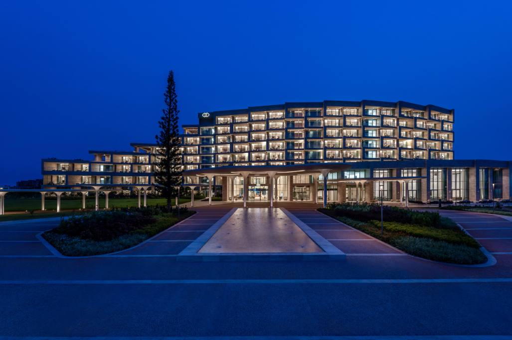
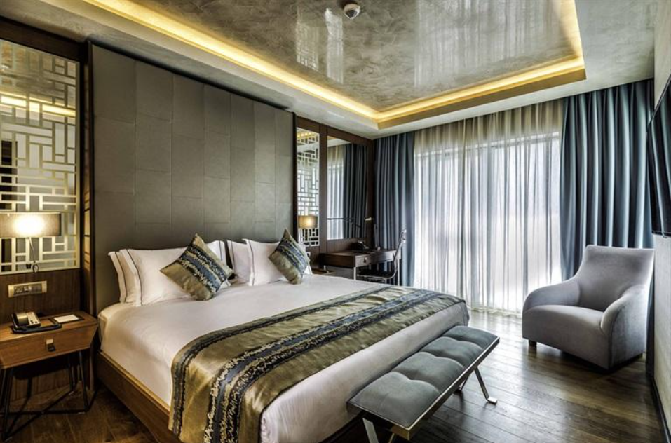
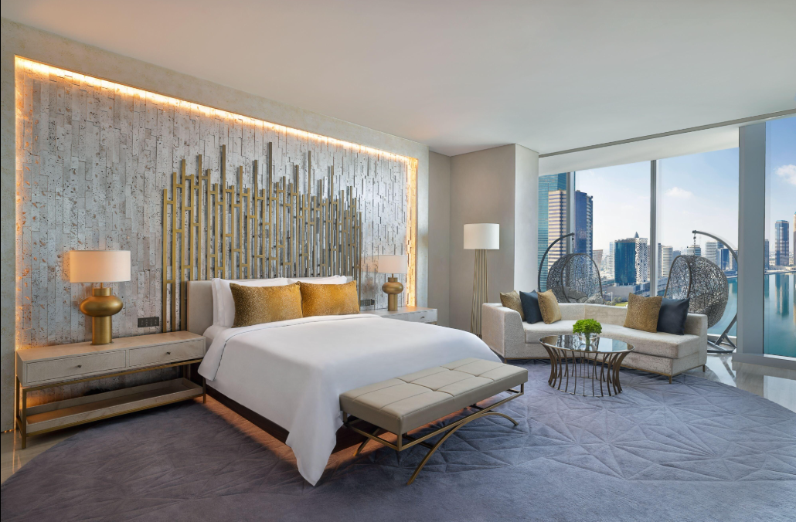
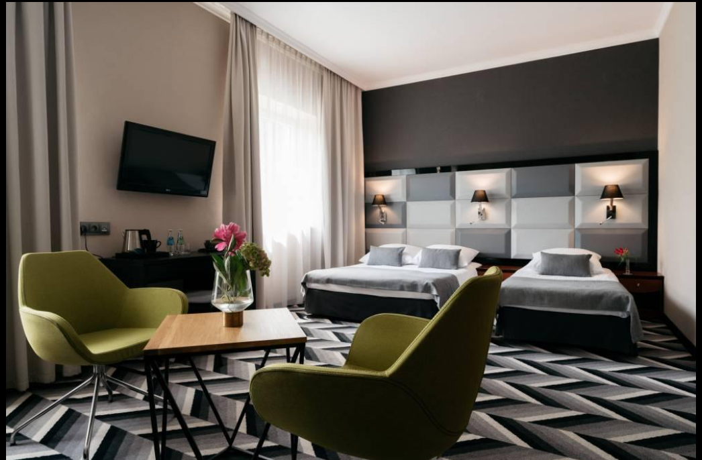
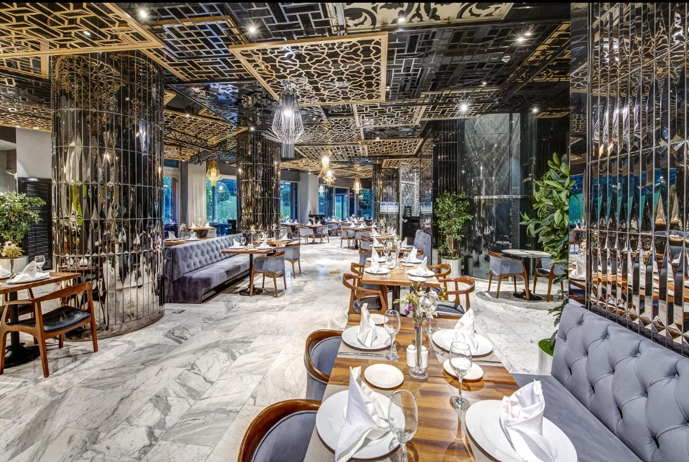

# Ex02 Commercial Website
## Date:27-07-2026 

## AIM
To create a commercial website using CSS Flexbox.

## ALGORITHM
### STEP 1
Create an HTML file (index.html)

### STEP 2
Create a CSS file (style.css)

### STEP 3
Include a navigation bar with links to different sections.

### STEP 4
Add structured sections for Homepage, Products / Services, About Us, Contact Details and User Account.

### STEP 5
Include social media links at the footer with copyright information.

### STEP 6
Define global styles for fonts, colors, and layout.

### STEP 7
Style the header, navigation bar, and sections.

### STEP 8
Use Flexbox for layout design.

### STEP 9
Add hover effects and transitions for interactivity.

### STEP 10
Add Images and Media.

### STEP 11
Use optimized images for a professional look.

### STEP 12
Open the HTML file in a browser to check layout and functionality.

### STEP 13
Fix styling issues and refine content placement.

### STEP 14
Deploy the website.

### STEP 15
Upload to GitHub Pages for free hosting.

## PROGRAM
```
index.html
<!DOCTYPE html>
<html lang="en">
<head>
<meta charset="UTF-8">
<meta name="viewport" content="width=device-width, initial-scale=1.0">
<title>Royal Stay Hotel</title>

<link rel="stylesheet" href="style.css">
</head>

<body>

<header>

<nav>

<h2 class="logo">RoyalStay</h2>

<ul>

<li><a href="#">Home</a></li>
<li><a href="#rooms">Rooms</a></li>
<li><a href="#services">Services</a></li>
<li><a href="#contact">Contact</a></li>

</ul>

</nav>

<div class="hero">

<div class="hero-text">

<h1>Luxury Stay<br>For Your<br>Dream Vacation</h1>

<p>
Experience premium rooms, world-class dining,
and unforgettable hospitality.
</p>

<button>Book Now</button>

</div>

<div class="hero-image">



</div>

</div>

</header>

<section id="rooms">

<h2>Our Rooms</h2>

<div class="cards">

<div class="card">



<h3>Deluxe Room</h3>

<p>$120 / Night</p>

<button>Book</button>

</div>

<div class="card">



<h3>Luxury Suite</h3>

<p>$220 / Night</p>

<button>Book</button>

</div>

<div class="card">



<h3>Family Room</h3>

<p>$180 / Night</p>

<button>Book</button>

</div>

<div class="card">



<h3>Restaurant</h3>

<p>Fine Dining</p>

<button>Explore</button>

</div>

</div>

</section>

<footer id="contact">

<h3>Royal Stay Hotel</h3>

<p>Email : royalstay@gmail.com</p>

<p>Phone : +91 9876543210</p>

<p>© 2026 Royal Stay Hotel</p>

</footer>


</body>
</html>
```
```
style.css
*{
margin:0;
padding:0;
box-sizing:border-box;
font-family:Arial,sans-serif;
}

body{
background:#111827;
color:white;
}

nav{
display:flex;
justify-content:space-between;
padding:20px 8%;
background:#0f172a;
}

.logo{
color:#38bdf8;
}

nav ul{
display:flex;
list-style:none;
gap:30px;
}

nav a{
color:white;
text-decoration:none;
}

.hero{
display:flex;
justify-content:space-between;
align-items:center;
padding:80px;
}

.hero-text{
width:45%;
}

.hero h1{
font-size:60px;
margin-bottom:20px;
}

.hero p{
font-size:18px;
margin-bottom:25px;
}

button{
padding:12px 30px;
background:#38bdf8;
border:none;
border-radius:25px;
cursor:pointer;
font-weight:bold;
}

button:hover{
background:#0284c7;
color:white;
}

.hero-image img{
width:500px;
border-radius:15px;
box-shadow:0 10px 30px rgba(0,0,0,.5);
}

section{
padding:70px 8%;
}

section h2{
text-align:center;
margin-bottom:40px;
font-size:40px;
}

.cards{
display:grid;
grid-template-columns:repeat(auto-fit,minmax(250px,1fr));
gap:30px;
}

.card{
background:#1e293b;
padding:20px;
border-radius:15px;
text-align:center;
transition:.3s;
}

.card:hover{
transform:translateY(-10px);
}

.card img{
width:100%;
height:180px;
object-fit:cover;
border-radius:10px;
margin-bottom:15px;
}

.card h3{
margin:15px 0;
}

footer{
background:#020617;
padding:30px;
text-align:center;
}
```
## OUTPUT


## RESULT
The program for creating commercial website using CSS Flexbox is executed successfully.
